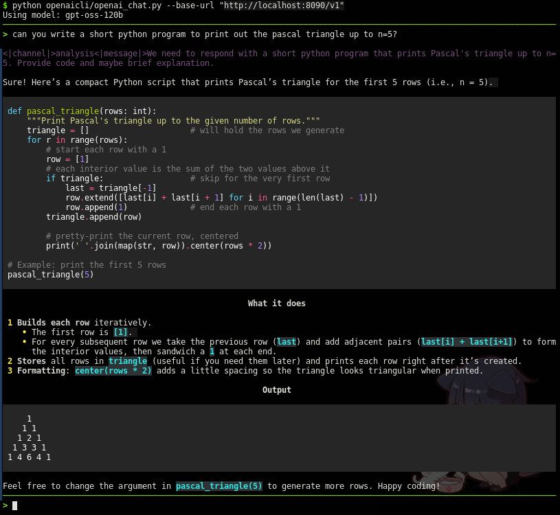
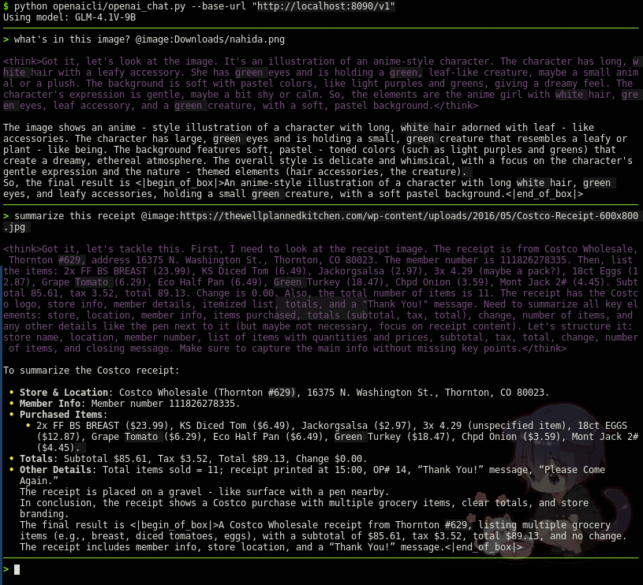

# OpenAI-compatible Chat CLI

A simple, single-file command-line chat client compatible with the OpenAI API.

*(or "I just want to quickly test my model hosted with vllm but don't want to spin up openwebui")*



## Features

- **OpenAI API Compatible:** Works with any self-hosted LLM platform that supports OpenAI chat completions API.
- **Image Support:** Send local or remote images to models that support vision.
- **Syntax Highlighting:** Renders Markdown in the terminal for better readability.
- **Extremely simple:** Single file, no installation needed.

## Installation

1. **Clone the repository:**
   ```bash
   git clone https://github.com/doryiii/openai-cli.git
   cd openai-cli
   ```

2. **Install the dependencies:**
   ```bash
   pip install -r requirements.txt
   ```

Or use your operating system's package manager to install python requests, termcolor, and rich

## Usage

```bash
python openai_chat.py --base-url "https://api.openai.com/v1"
```

### Flags

| Flag              | Description                                                                         |
| ----------------- | ----------------------------------------------------------------------------------- |
| `--base-url`      | **(Required)** The base URL of the OpenAI-compatible API.                           |
| `--model`         | The model to use. If not given, the first model returned by the API will be used.   |
| `--api-key`       | The API key for the service. Defaults to the `OPENAI_API_KEY` environment variable. |
| `--system`        | Optional system prompt to give to the model                                         |
| `--hide-thinking` | Hide the thinking process output of the model.                                      |

### Images



To send an image, use the `@image:` tag at the end of your prompt:

```
> Tell me about this image @image:path/to/your/image.png
```

You can also use a URL:

```
> What do you see in this image? @image:https://example.com/image.jpg
```

### Piping

You can pipe text into stdin:

```bash
echo "Hello, world!" | python openai_chat.py --base-url "https://api.openai.com/v1" --hide-thinking
```

## Dependencies

- [requests](https://pypi.org/project/requests/)
- [termcolor](https://pypi.org/project/termcolor/)
- [rich](https://pypi.org/project/rich/)
